# Architecture Deep Dive

This page documents the runtime architecture and algorithms that power AniBridge's modular pipeline:

- STRM / STRM Proxy
- Torznab
- qBittorrent-compatible API
- Downloader
- Database/cache layers
- Providers (AniWorld, s.to, Megakino)
- Slug resolution and best-match logic
- Prowlarr/Sonarr integration lifecycle

[[toc]]

## System Topology

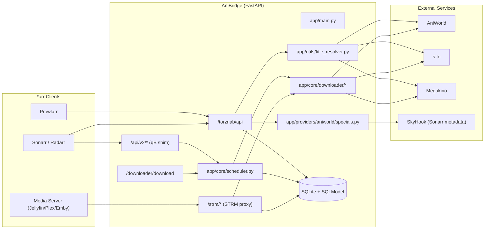

## Module Boundaries

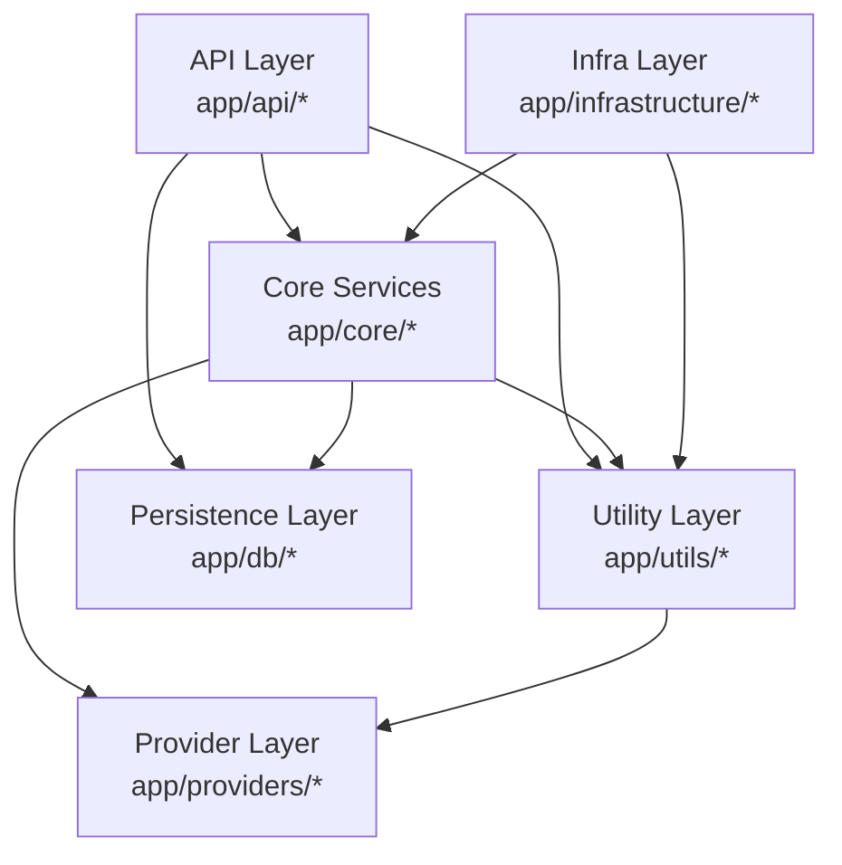

## Torznab Pipeline

### Endpoint Modes

`/torznab/api` supports:

- `t=caps`
- `t=search`
- `t=movie` / `t=movie-search`
- `t=tvsearch`

### `tvsearch` Runtime Flow

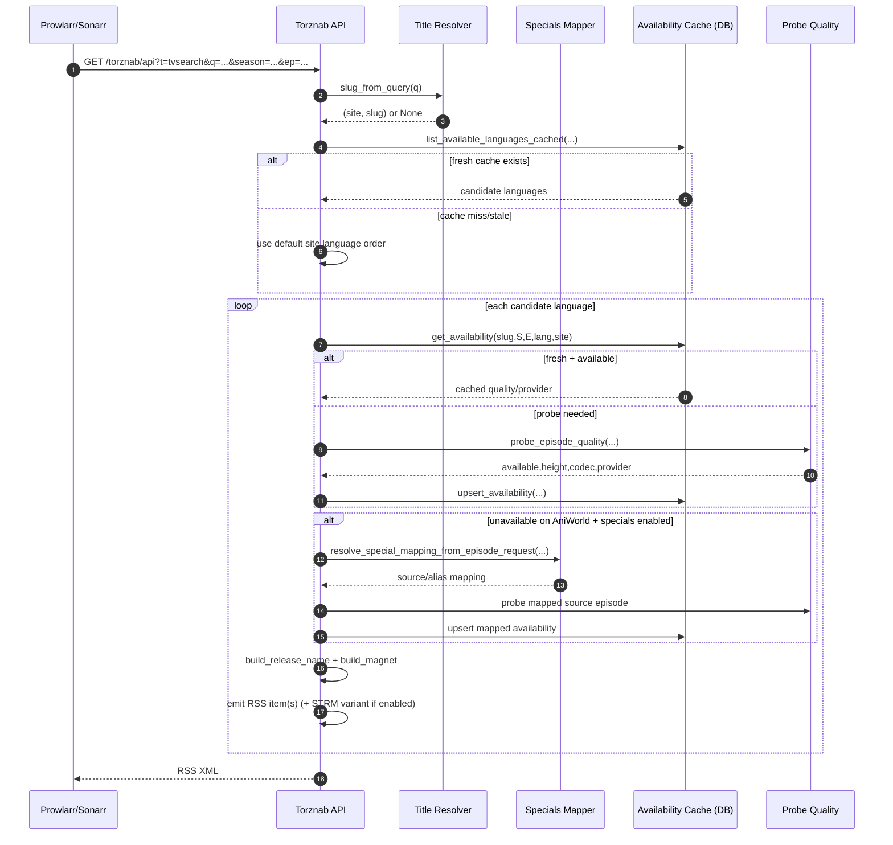

### Torznab Item Construction

For each successful candidate, AniBridge builds:

- release title with `build_release_name(...)`
- magnet payload with site-specific metadata prefix (`aw_` or `sto_`)
- optional `aw_mode/sto_mode=strm` variant when STRM mode is active
- Torznab attributes (`magneturl`, `size`, `infohash`, language/subs hints)

## Slug Resolution and Best-Match Algorithm

Slug resolution is centralized in `app/utils/title_resolver.py`.

### Site Selection Strategy

1. Search primary configured sites first (`CATALOG_SITES_LIST` excluding Megakino).
2. If no good match, fallback to Megakino.
3. If a site has no alphabet index, use search-only logic for that provider.
4. For `s.to`, fallback to suggest API (`/api/search/suggest`).

### Matching Flow

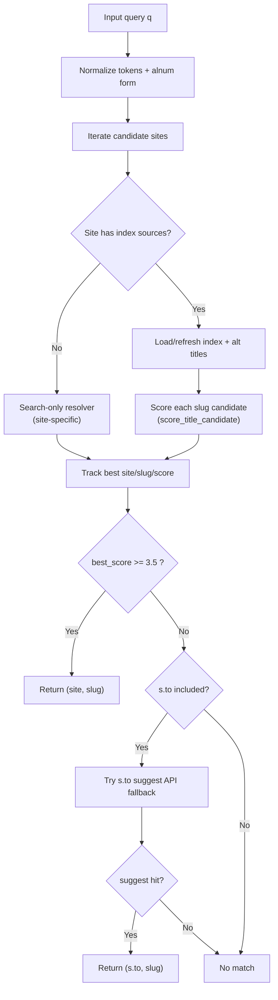

### Score Formula

`_score_title_candidate()` combines:

- exact normalized match boost
- substring containment boost
- token F1 score
- token precision/recall
- SequenceMatcher similarity (only when F1 is high enough)

The resolver accepts a candidate when score `>= 3.5`.

## AniWorld Specials Mapping (Alias vs Source Episode)

AniWorld specials (`/filme/film-N`) can diverge from Sonarr numbering. AniBridge maps:

- source episode: what AniWorld actually hosts
- alias episode: what Sonarr expects for import parsing

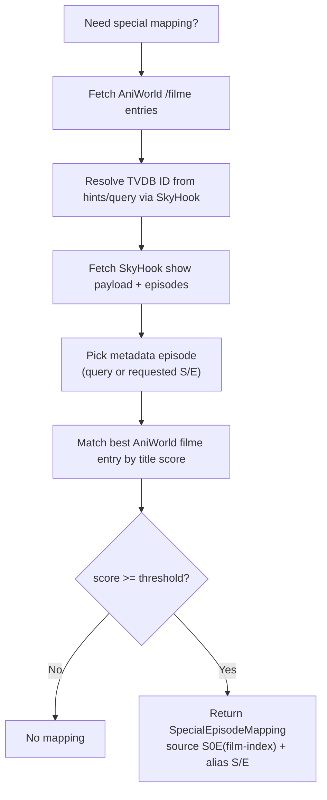

When a mapping exists:

- probing/downloading uses the source episode
- release naming/GUID adds alias markers
- Sonarr import sees alias-compatible naming

## qBittorrent API Shim Pipeline

The shim lives under `/api/v2/*` and tracks jobs through `ClientTask`.

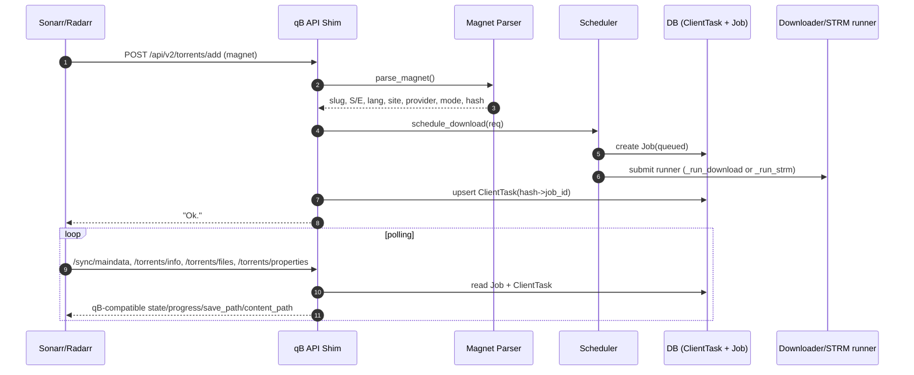

### Shim Surface Summary

- Auth endpoints are permissive and set/delete `SID` cookie.
- Category endpoints maintain in-memory category map.
- State is DB-backed (`ClientTask` + `Job`) rather than torrent engine backed.
- `/torrents/delete` can cancel running jobs and optionally delete result files.

## Downloader and Provider Fallback

`app/core/downloader/download.py` orchestrates download fallback.

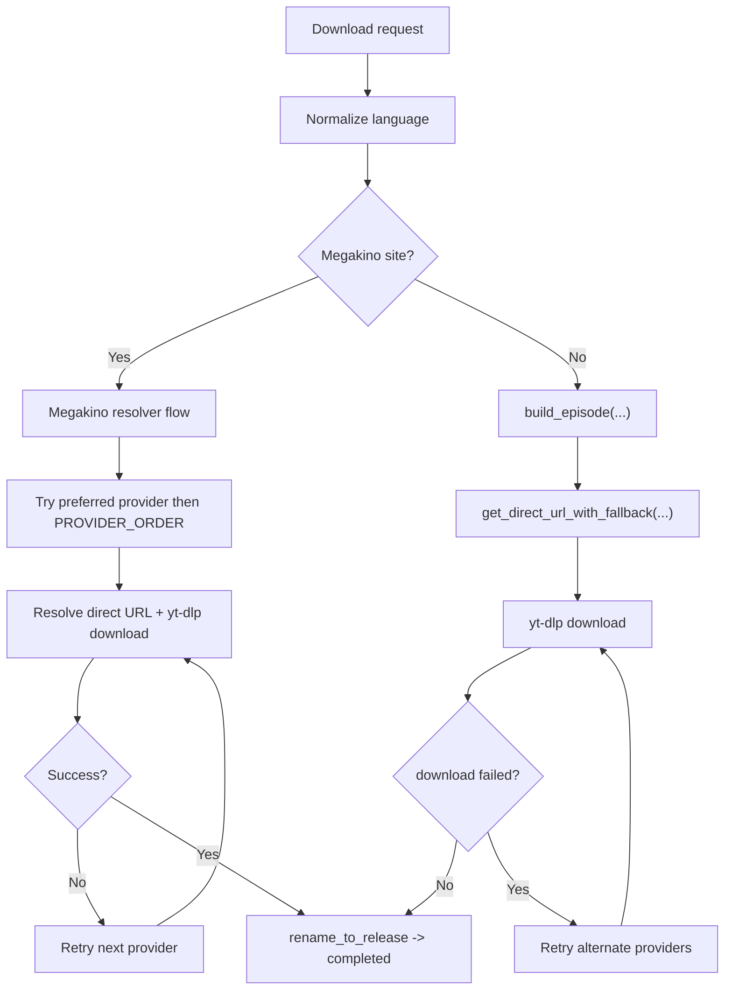

### Provider Resolution Rules

- Preferred provider is tried first when supplied.
- Fallback order uses `PROVIDER_ORDER`.
- Language availability is validated before provider iteration.
- Megakino has dedicated sitemap/search/direct-link client flow.

## STRM Creation and STRM Proxy

### STRM Job Creation (`mode=strm`)

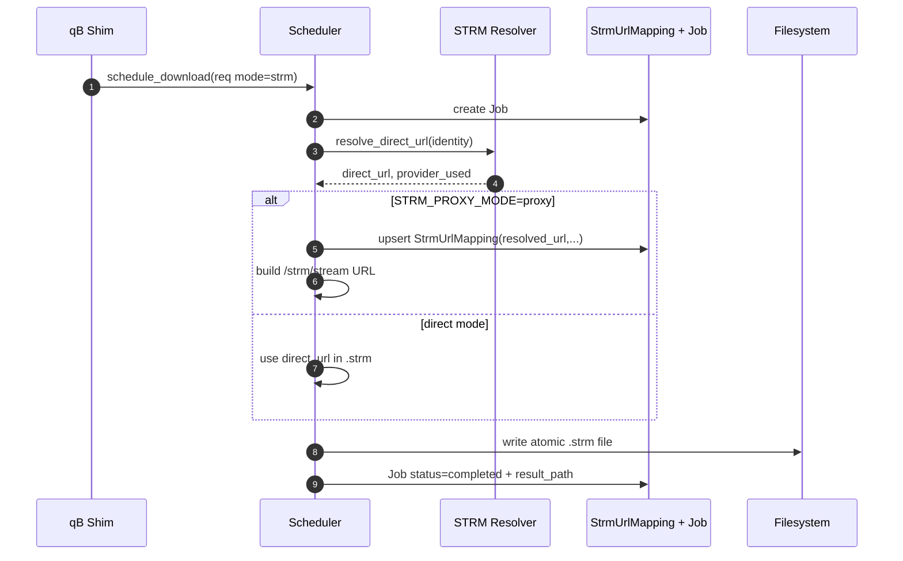

### Playback Proxy Flow (`/strm/stream`, `/strm/proxy`)

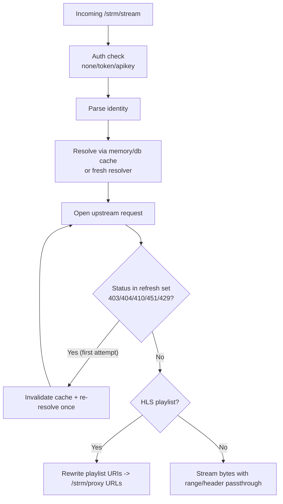

Key behaviors:

- signed token/apikey auth for STRM URLs (configurable)
- DB + in-memory STRM mapping cache
- retry-on-refresh-status with cache invalidation
- HLS rewrite of segments/keys/media URIs so all requests stay in AniBridge

## Persistence Model

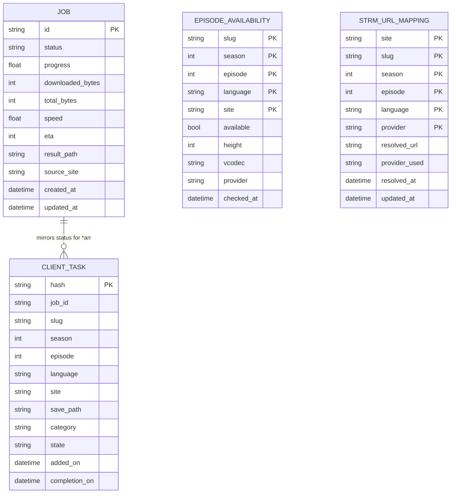

### Job State Model

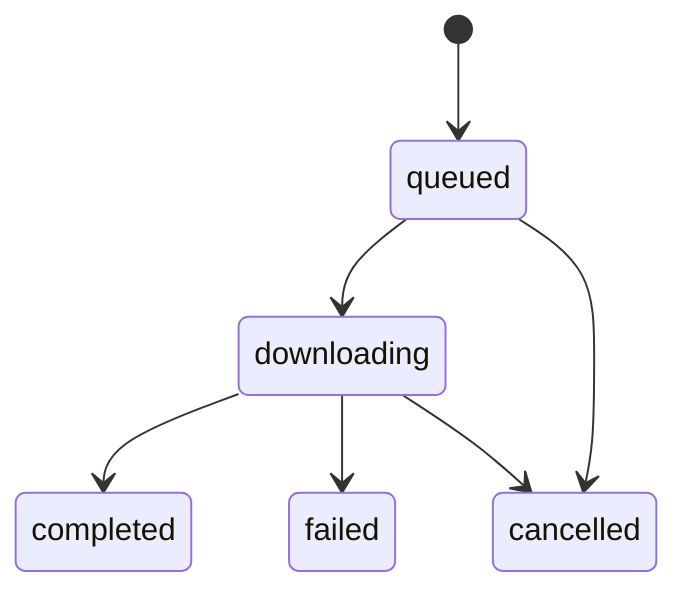

## Provider-Specific Indexing and Resolution

| Provider | Index Strategy | Search Strategy | Direct Resolution Path |
|---|---|---|---|
| AniWorld (`aniworld.to`) | Alphabet index URL/HTML cached with TTL | Token/title score matching over index + alternatives | Build episode -> provider fallback -> yt-dlp |
| s.to (`s.to`) | Alphabet index URL/HTML cached with TTL | Same score logic, plus suggest API fallback | Build/enrich episode (`sto.v2`) -> provider fallback -> yt-dlp |
| Megakino (`megakino`) | Sitemap index cache | Native client search + slug heuristics | Megakino client resolves iframe/provider direct URL |

Notes:

- `app/providers/registry.py` is deprecated compatibility code. Use `app.providers.get_provider()` / `list_providers()`.
- Provider defaults and ordering come from `CATALOG_SITE_CONFIGS` + `PROVIDER_ORDER`.

## End-to-End Sonarr + Prowlarr Workflow

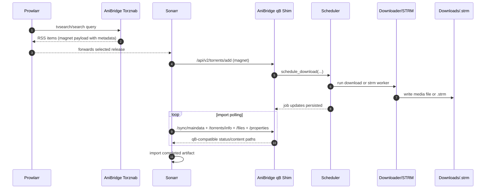

## Practical Debug Anchors

When debugging cross-module behavior, start in this order:

1. `app/api/torznab/api.py` for release generation logic.
2. `app/utils/title_resolver.py` for slug matching and site fallback.
3. `app/api/qbittorrent/torrents.py` for magnet intake and job enqueue.
4. `app/core/scheduler.py` for runner selection (`download` vs `strm`).
5. `app/core/downloader/download.py` for provider fallback behavior.
6. `app/api/strm.py` + `app/core/strm_proxy/*` for playback proxy behavior.
7. `app/db/models.py` for persisted state and cache freshness rules.
