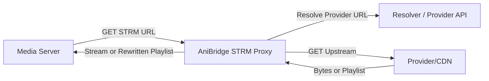

# Proposed Architecture

## Status

Draft

## Scope

Define the target architecture and endpoint contracts for STRM proxy streaming, HLS playlist rewriting, Range handling, refresh-on-failure, and auth, while clearly marking decision gates that require maintainer input.

## Last updated

2026-02-03

## Design Principles

1. Preserve default behavior unless `STRM_PROXY_MODE` (or equivalent) is explicitly enabled.
2. Keep STRM proxy URLs stable and stateless by encoding episode identity in query parameters.
3. Avoid redirects; always stream bytes through AniBridge to preserve VPN egress consistency. See `specs/006-fix-strm-files/context.md:23`.
4. Implement HLS-aware rewriting for all playlists and URI-bearing tags per HLS specification. citeturn3view3turn3view4
5. Preserve HTTP Range semantics end-to-end. citeturn2view2turn2view3

## High-Level Flow



## HLS Rewrite Flow

```mermaid
flowchart TD
  A[Client requests /strm/stream] --> B{Upstream is HLS playlist?}
  B -->|No| C[Stream bytes with Range support]
  B -->|Yes| D[Fetch playlist]
  D --> E[Rewrite all URI-bearing lines/tags]
  E --> F[Return rewritten playlist]
  F --> G[Client follows rewritten URIs]
  G --> H[/strm/proxy endpoint]
  H --> I[Stream segment/key/init bytes]
```

## Endpoint Layout Options (Decision Gate)

Option A: Single entry endpoint with a generic proxy endpoint.

- `/strm/stream` for initial STRM requests.
- `/strm/proxy` for rewritten URIs (segments, keys, child playlists).

Option B: Explicit HLS endpoints.

- `/strm/hls/master` for master playlist retrieval and rewrite.
- `/strm/hls/proxy` for segment/key/child playlist bytes.
- `/strm/stream` for non-HLS direct streams.

Decision gate: choose A or B based on maintainer preference for URL clarity vs endpoint sprawl and backwards compatibility with prior STRM spec drafts.

## Proposed Query Parameters (Draft)

These are draft inputs that must be confirmed by maintainers.

- `site`: source site identifier (from magnet payload). Evidence of current usage in `app/api/qbittorrent/torrents.py:66`.
- `slug`: series slug.
- `s`: season number.
- `e`: episode number.
- `lang`: language label.
- `provider`: optional provider override.
- `token` or `sig`: auth token or HMAC signature.
- `exp`: optional expiry timestamp for signed URLs.

## Response Contract (Draft)

1. For non-HLS media, respond with a streaming body using `StreamingResponse` semantics, preserving upstream status code and key headers. FastAPI/Starlette streaming responses accept generators/iterators to stream bodies. citeturn2view1turn5view0
2. For HLS playlists, respond with `Content-Type: application/vnd.apple.mpegurl` and a rewritten playlist body. HLS playlist structure and tag/URI requirements are defined in RFC 8216. citeturn3view3turn3view4
3. When the request includes `Range`, forward it upstream and preserve `206 Partial Content` with `Content-Range` or return `416 Range Not Satisfiable` for invalid ranges. citeturn2view2turn2view3

## Request Lifecycle (Draft)

1. Validate query params and auth token/signature.
2. Build episode identity and check cache for a resolved URL and any required headers.
3. If cache miss or refresh required, resolve via `get_direct_url_with_fallback` (same resolver used for STRM). Evidence in `app/core/scheduler.py:215`.
4. Fetch upstream response using a streaming HTTP client (HTTPX or aiohttp). citeturn13view0turn14view0
5. If upstream is HLS playlist, rewrite all URIs to `/strm/proxy` (or `/strm/hls/proxy`) and return rewritten playlist.
6. If upstream fails with refresh-eligible status, re-resolve and retry once before failing. See `specs/010-strm-proxy-stream/github-issue.md:103`.

## Auth And Signing (Draft)

- Default: `STRM_PROXY_AUTH=token` (HMAC) or `apikey`, configurable.
- Token design uses HMAC with expiry to prevent replay. HMAC is standardized in RFC 2104. citeturn16view0

## Decision Gates

1. Endpoint layout (Option A vs B).
2. Mandatory vs optional `provider` parameter.
3. Auth scheme default and expiry window.
4. Cache TTL targets and cache scope.
5. Whether to expose `HEAD` passthrough.

These are intentionally left open until maintainer questions are resolved.
